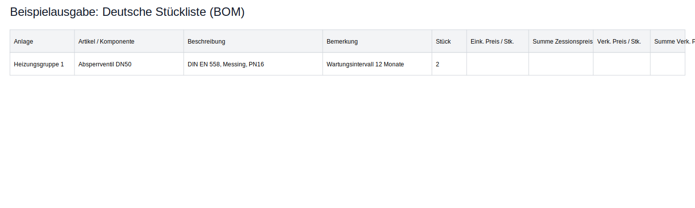

# Technical Drawing Analyzer - Frontend

A modern React frontend for analyzing technical drawings and documents using **GPT-5.4 Vision API (oder neuer)**. This tool provides comprehensive component identification, Bill of Materials (BOM) generation, and detailed technical analysis for engineering drawings, schematics, and technical documents.

## 🏗️ Architecture

This repository contains the **frontend only**. The application uses a microservices architecture:

- **Frontend (This Repo)**: React + TypeScript + Vite, deployed on Vercel
- **Backend**: Node.js + Express API, deployed on Render
- **AI Service**: OpenAI GPT-5.4 Vision API (oder neuer)

## 🌟 What Makes This Special

- **Modern Frontend**: React 18 + TypeScript + Vite for optimal performance
- **GPT-5.4 Vision Integration**: Nutzt das aktuelle Vision-Modell via `/api/analyze` für technische Zeichnungsanalyse
- **Beautiful UI/UX**: Responsive design with drag-and-drop file upload
- **Production Ready**: Optimized for Vercel deployment
- **Secure**: Environment-based configuration and secure API communication

## ✨ Features

- **GPT-5 Powered Analysis**: Utilizes the latest GPT-5 Vision API for superior technical drawing interpretation
- **Multiple File Formats**: Supports PNG, JPG, PDF, DOC, and DOCX files
- **Comprehensive BOM Generation**: Extracts detailed component information including:
  - Component names and identifiers
  - Quantities and specifications
  - Materials and ratings
  - Reference codes and locations
  - Technical specifications
- **Modern React Frontend**: Beautiful, responsive UI with drag-and-drop file upload
- **Secure API Backend**: Flask-based REST API with authentication
- **Real-time Analysis**: Instant processing and results display
- **Export Capabilities**: Download analysis results as CSV files
- **Single Server Deployment**: Frontend and backend served from one application

## 🚀 Technology Stack

### Frontend (This Repository)
- **React 18** with TypeScript
- **Vite** for fast development and building
- **Tailwind CSS** for modern, responsive design
- **Lucide React** for beautiful icons
- **React Dropzone** for file uploads

### Backend (Separate Repository)
- **Node.js** with Express
- **OpenAI GPT-5.4 Vision API (oder neuer)** für Dokumentanalyse mit strukturierten JSON-Antworten
- **Express-Session** for authentication
- **CORS** for secure cross-origin requests

### Deployment
- **Frontend**: Vercel (static hosting)
- **Backend**: Render (Node.js hosting)
- **Environment Variables**: Secure configuration management

## 📋 Prerequisites

- Node.js 18+
- npm or yarn
- Backend API running (see backend repository)

## 🛠️ Quick Start

### 1. Clone and Setup
```bash
git clone <repository-url>
cd TechDrawings-4
```

### 2. Install Dependencies
```bash
npm install
```

### 3. Environment Configuration
```bash
cp env.example .env.local
# Edit .env.local with your backend API URL
```

### 4. Run Development Server
```bash
npm run dev
```

### 5. Access the Application
- Open your browser and go to: **http://localhost:5173**
- Login with your backend credentials
- Start analyzing technical drawings!

## 🌐 Production Deployment

This application is designed to be deployed as a **complete web application** with several deployment options:

- **Single Server**: Nginx + Flask with integrated frontend
- **Docker**: Containerized deployment
- **Cloud Platforms**: AWS, GCP, Azure deployment guides

See [DEPLOYMENT.md](DEPLOYMENT.md) for detailed deployment instructions.

## 📱 Usage

### 1. Authentication
- Default credentials: `admin` / `admin`
- Configure custom credentials in the `.env` file

### 2. File Upload
- Drag and drop technical drawings, PDFs, or Word documents
- Supported formats: PNG, JPG, PDF, DOC, DOCX
- Maximum file size: 20MB

### 3. Analysis
- The system automatically analyzes uploaded files using GPT-5
- Results include comprehensive component identification
- Detailed BOM with technical specifications

### 4. Export
- Download analysis results as CSV files
- Results include all component details and specifications

## 🔧 API Endpoints

### Authentication
- `POST /api/login` - User authentication
- `POST /api/logout` - User logout

### File Analysis
- `POST /api/upload` - File upload and analysis
- `POST /api/analyze` - Analyze files from frontend
- `GET /api/download` - Download CSV results

### Chat
- `POST /api/chat` - Chat with the AI assistant

### Health Check
- `GET /health` - Server health status

### Web Application
- `GET /` - Serves the React frontend
- `GET /<path>` - Serves static files and handles routing

## 🎯 Supported Technical Standards

The analyzer follows international engineering standards:
- **VDI 3814** - Building automation and control systems
- **ISO 16484** - Building automation and control systems
- **ISO 14617** - Graphical symbols for diagrams
- **IEC 60617** - Graphical symbols for diagrams
- **DIN EN 81346** - Reference designation system

## 🔍 Component Detection

The system identifies and categorizes:
- **Control Valves**: Ball, Gate, Check, Control, Safety, Solenoid
- **Pumps & Motors**: Various types and specifications
- **Sensors & Instruments**: Measurement and control devices
- **Control Systems**: PLCs, DCS, SCADA components
- **Pipes & Fittings**: Conduits, supports, and connections
- **Electrical Components**: Wiring, switches, and power systems
- **HVAC Equipment**: Heating, ventilation, and air conditioning
- **Safety Systems**: Emergency and protection equipment


## 🧾 Deutsches BOM-Format & Export

Die UI rendert Analyseergebnisse als deutsche Excel-ähnliche Stückliste mit folgenden Spalten:

- Anlage
- Artikel / Komponente
- Beschreibung
- Bemerkung
- Stück
- Eink. Preis / Stk.
- Summe Zessionspreis
- Verk. Preis / Stk.
- Summe Verk. Preis

Zusätzlich steht ein Button **„CSV/Excel herunterladen“** bereit, der die aktuelle Stückliste als CSV exportiert.

### Beispiel (BOM-Ansicht)



## 🔌 Backend-Integration (separates Repo)

Diese Frontend-Anwendung erwartet, dass der Backend-Endpunkt `/api/analyze` ein JSON im folgenden Format liefert:

```json
{
  "response": "Deutsche Zusammenfassung",
  "bom": [
    {
      "Anlage": "Heizungsgruppe 1",
      "Artikel / Komponente": "Absperrventil DN50",
      "Beschreibung": "DIN EN 558, Messing, PN16",
      "Bemerkung": "Wartungsintervall 12 Monate",
      "Stück": 2,
      "Eink. Preis / Stk.": null,
      "Summe Zessionspreis": null,
      "Verk. Preis / Stk.": null,
      "Summe Verk. Preis": null
    }
  ],
  "relationships": [
    { "parent": "Heizungsgruppe 1", "child": "Absperrventil DN50" }
  ]
}
```

Empfohlene Backend-Umsetzung:
- Vision-Service-Modul (z. B. `visionService.ts`) mit `analyzeDrawing(base64Data, fileType)`.
- Aufruf von `openai.chat.completions.create` mit `model: "gpt-5.4-vision"` (oder neuer).
- JSON-/Function-Calling-Schema erzwingt die oben gezeigte BOM-Struktur.
- Umgebungsvariablen über dotenv laden: `OPENAI_API_KEY`, optional `OPENAI_ORGANIZATION`.

## 🚨 Troubleshooting

### Common Issues

1. **PDF Processing Errors**:
   - Ensure Poppler is properly installed
   - Check file permissions and accessibility

2. **OpenAI API Errors**:
   - Verify API key is valid and has GPT-5 access
   - Check API quota and billing status

3. **File Upload Issues**:
   - Ensure file size is under 20MB
   - Check file format compatibility

4. **Authentication Problems**:
   - Verify environment variables are set correctly
   - Check session configuration

5. **Frontend Not Loading**:
   - Ensure `npm run build` completed successfully
   - Check if `dist` folder exists
   - Verify Flask is serving static files correctly

### Debug Mode
Enable debug logging by setting:
```python
app.run(debug=True)
```

## 🌍 Web Application Features

### Integrated Frontend
- **Single Server**: No need for separate frontend/backend servers
- **Automatic Routing**: Flask handles both API and frontend routes
- **Production Build**: Optimized React build served by Flask
- **Responsive Design**: Works on desktop, tablet, and mobile devices

### Security Features
- **Session Management**: Secure user authentication
- **File Validation**: Secure file upload handling
- **CORS Configuration**: Proper cross-origin request handling
- **Environment Variables**: Secure configuration management

## 🤝 Contributing

1. Fork the repository
2. Create a feature branch
3. Make your changes
4. Add tests if applicable
5. Submit a pull request

## 📄 License

This project is licensed under the MIT License - see the [LICENSE](LICENSE) file for details.

## 🙏 Acknowledgments

- OpenAI for providing the GPT-5 Vision API
- The open-source community for various libraries and tools
- Engineering standards organizations for technical specifications

## 📞 Support

For support and questions:
- Create an issue in the repository
- Check the troubleshooting section
- Review the [DEPLOYMENT.md](DEPLOYMENT.md) guide
- Check the API documentation

---

**🚀 Ready to deploy as a complete web application!**

**Built with ❤️ for the engineering community**
